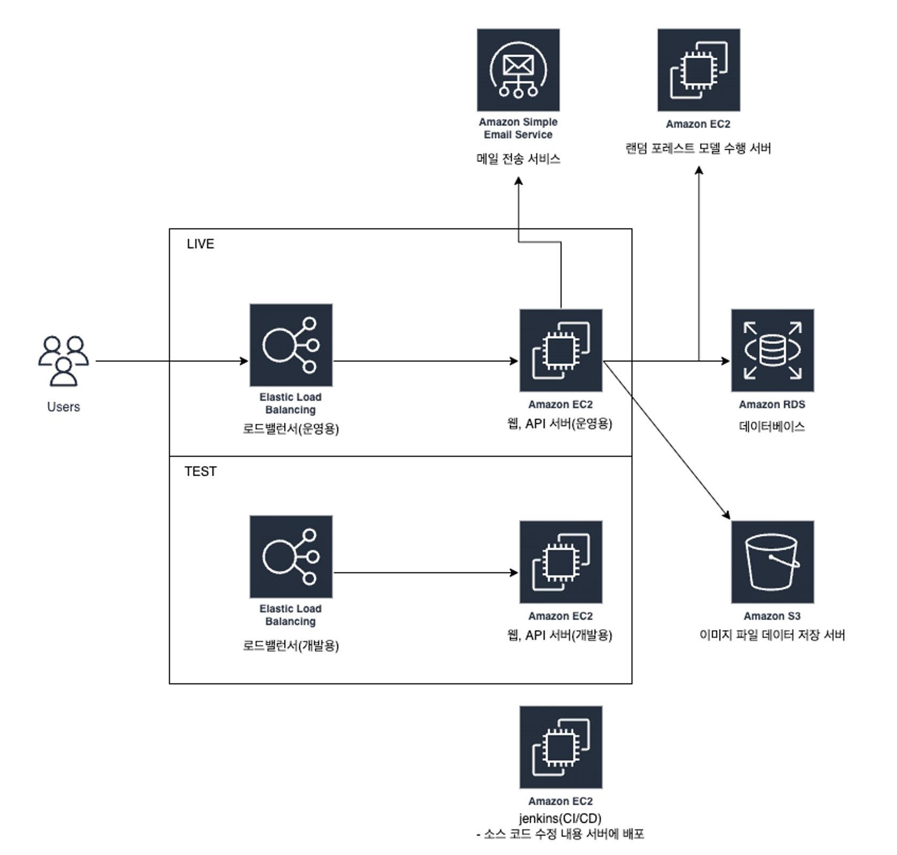

# 소개
안녕하세요. 지속적인 학습으로 더 나은 환경을 만드는 개발자입니다.
새로운 기술에 대한 호기심과 열정을 바탕으로 더 나은 환경을 만드는데 열정을 가진 개발자로서, Typescript, NestJS 및 AWS 인프라를 활용한 백엔드 개발 및 운영을 한 경험이 있습니다. 
DevOps 및 최신 기술 트렌드에 대한 지속적인 학습을 통해 역량을 강화하고 있습니다.
 
 

# 프로젝트
## 1. 사내 직원 대상 걷기 운동 플랫폼
사내 직원들의 걸음 데이터 수집 및 순위, 결과 제공 플랫폼 개발
### 사용 기술
- NestJS, Prisma, Postgresql로 백엔드 및 데이터베이스 구축
- EC2, ELB, S3, Jenkins, SES, Terraform, Docker를 통한 AWS 환경, 배포 구축 
 

## 2. 나라장터 조달 정보 수집 및 수요, 공급자 매칭 플랫폼
공공데이터 API를 활용하여 나라장터의 조달 정보를 수집하고, 이를 바탕으로 수요자와 공급자 간 매칭을 지원하는 웹사이트 개발
### 사용 기술 및 역할
- Typescript, NestJS, prisma, postgresql로 백엔드 구축
- AWS(EC2, ELB, RDS, S3) 및 Jenkins, Terraform, Docker를 사용한 CI/CD 및 인프라 구성
 
 

## 3. 유전자 검사 예약 및 결과 전달 플랫폼
유전자 검사 예약, 건강 검진 정보, 유전자 검사 정보를 통해 이상 여부를 판단하고 결과 정보를 제공하는 플랫폼 개발
### 사용 기술
- NestJS, Prisma
- EC2, ELB, S3, Jenkins, Docker
 

## 4. 해외 발생 환자와 국내 의료진 상담 및 정보 알림 플랫폼
해외 환자가 국내 의료 전문가와 상담을 예약 및 상담 서비스 제공 플랫폼 개발
### 사용 기술
- NestJS, Prisma, SocketIO를 사용한 실시간 통신 구현
- EC2, ELB, S3, Jenkins, SES, Docker
 

## 5. 전기차 사용자 충전기 설치 회사 매칭 플랫폼
전기차 충전기 설치에 관한 정보에 대해 제공 및 전기차 사용자와 충전기 설치 업체 간의 매칭 플랫폼 개발
 
 

 
### 사용 기술 및 역할
- ExpressJS, Sequelize, mysql로 백엔드 및 데이터베이스 구축 및 python, flask를 통해 충전량 관련 데이터 랜덤포레스트 모델을 통한 결과값 제공 API 서버 구축
- AWS(EC2, ELB, RDS, S3) 및 Jenkins를 사용한 인프라 구성 및 배포 자동화
 
 

## 6. 선생님, 학부모 간 자녀 책 읽기 서비스 매칭 플랫폼
학부모와 선생님 간의 매칭을 통해, 자녀에게 책을 읽어주는 매칭 플랫폼을 개발
###  사용 기술 및 역할
- ExpressJS, Sequelize, mysql로 백엔드 및 데이터베이스 구축
- AWS(EC2, ELB, RDS, S3) 및 Jenkins를 사용한 인프라 구성 및 배포 자동화
 
 

## 7. 반려묘 움직임 기록 및 전송, 결과 확인 플랫폼
고양이 목걸이를 통해 움직임 데이터를 수집하고 서버로 데이터를 가공 및 전송,앱 내에서 고양의 활동량과 건강지표를 상태를 확인하는 플랫폼 개발. 

### 사용 기술
- ExpressJS, Sequelize, mysql를 통해 백엔드 및 데이터베이스 구축, WebSocket을 통한 목걸이 기기에서 데이터 수집
- EC2, ELB, S3, Jenkins
 
 

## 8. 반려견 산책 심부름 매칭 기능
반려견주와 산책시켜 줄 사람들 간의 매칭하는 플랫폼을 개발
### 사용 기술
- ExpressJS, Sequelize
- EC2, ELB, S3, Jenkins, SocketIO, FFMPEG
 
 

## 9. 슬랙 기반 근태 관리 서비스
슬랙에 연동하여 출퇴근 및 연차 기록 제공 서비스 개발
### 사용 기술 및 역할
- 초기 ExpressJS, Sequelize를 통해 백엔드 및 데이터베이스 구축 및 NestJS, Prisma, Postgresql로 고도화 작업
- 초기 EC2, ELB, jenkins 구성에서 ECS, ELB, ECR, RDS 사용 및 Code Deploy, Github Action을 사용하는 부분으로 고도화 작업
 
 

## 10. 이더리움, ERC-20, 비트코인, 파일코인 지갑앱 개발
이더리움, ERC-20, 비트코인, 파일코인 보유현황 및 전송 기능 지갑앱 개발
### 사용 기술 및 역할
- ExpressJS, Sequelize를 통해 백엔드 및 데이터베이스 구축, Zabbix, Grafana를 통해 서버 상태 모니터링 기능 구축
 
 

# Contact
- paulayground@gmail.com
